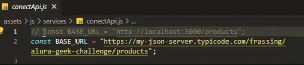

- [Sobre](#sobre-o-alurageek)
- [Importante](#importante)
- [Como executar](#como-executar)
- [Preview](#preview)
- [Requisitos do desafio](#requisitos-do-desafio)
- [Adições](#adições)

## Sobre o AluraGeek
A página **AluraGeek** funciona como uma admin page de um e-commerce. Nela podemos listar todos os produtos da base de dados em formato de cards, pesquisar na lista por nome, adicionar e remover produtos da lista.
<br>Este projeto é focado em trabalhar com requisições http (GET, POST, DELETE), manipular a base de dados através do Front-end e da comunicação com API, assincronismo, modularização de código.
<br>Para consumir os dados de uma forma dinâmica geramos o mockup de uma API utilizando o json-server na versão 0.17.4. 

### Tecnologias utilizadas
- HTML5; 
- CSS3;
- JavaScript;
- Node.js;
- json-server;

### Importante
A live demo deste projeto está rodando utilizando um recurso [typicode](https://my-json-server.typicode.com/) que gera um servidor fake quando criamos um arquivo *db.json* na raiz do projeto, na branch main.
<br>Você pode utilizar as funcionalidades de visualizar a lista de produtos, adicionar e pesquisar, mas o recurso não salva alterações, todas as manipulações feitas serão perdidas ao recarregar a página, informações sobre como trabalhar com um servidor local ao clonar o projeto estão descritas abaixo.

<div style="text-align:center">
	
</div>

## Como executar
- É necessário ter o Node.js instalado.
1. Faça o clone deste repositório.
2. Abra a pasta do projeto na IDE de sua preferência, será preciso instalar o json-server se não o tiver
	- Digite no terminal: `npm install json-server@0.17.4` para instalar no projeto
3. Abra o arquivo "conectApi.js", o caminho completo: `assets/js/services/conectApi.js`
	- Descomente a linha 1 (CTRL+;), e exclua a linha 2. Desta forma, você utilizará o caminho do servidor local em vez do fake online.
	- Lembre-se que se precisar alterar a porta, é nesta const que fará a alteração
	
4. Digite o comando `npm start` no terminal para começar a rodar o servidor. Este script foi definido no arquivo `package.json`, caso queira alterar.
	- Ele já inicia o comando do json-server de monitorar (--watch) as mudanças no db.json
5. A partir daqui o seu servidor local deverá estar rodando!
	- Para interromper a execução digite `CTRL+C` no terminal
6. Para acompanhar as mudanças na parte visual do projeto recomendo a extensão "Live Server (Five Server)" no VS Code.
>[!IMPORTANT] extensão five server e recarregamento:
> Caso encontre problemas com o recarregamento indesejado na página, crie um arquivo "neutralize.js" e vincule-o ao head do index.html. A extensão pode fazer a página recarregar antes de finalizar algumas funcionalidades (modais podem sofrer instabilidade).
- O código para adicionar ao arquivo neutralize:
```javascript
// Neutralizar reload de página do five server
window.addEventListener('load', (e) => {
    e.stopImmediatePropagation(); // Neutraliza o evento de load
    console.log('Evento de load interceptado.');
});

window.location.reload = () => {
    console.log('Reload bloqueado.');
};
```
## Preview
<div style="text-align:center">
	
</div>

## Requisitos do desafio
- Simular uma api com json-server ou site mockapi.
- Desenvolver requisição GET para acessar a lista de produtos.
- Manipular o DOM e criar cards de produtos dinamicamente.
- Renderizar a lista de produtos de forma dinâmica no HTML.
- Desenvolver requisição POST para adicionar produtos ao banco de dados (db.json).
- O usuário deve poder salvar um novo produto após preencher os campos do formulário.
- Capturar os dados do novo produto (nome, valor, url da imagem) através do formulário e salvá-lo na base de dados.
- Desenvolver requisição DELETE para remover produto do banco de dados.
- O usuário deve poder clicar no ícone de lixeira para remover um produto do banco de dados.


### Adições
- Padronizar nome dos produtos ao adicionar na database. Ex.: "Este", "ESTE", "esTe" ou "este" serão adicionados como "**este**" e renderizados como "Este".
- Garantir que os valores sejam exibidos num padrão monetário de Real (00,00). Ex.: "2500", "2.3", "2.34" ou "124,90" serão adicionados como "2500,00", "2,30", "2,34" e "124,90".
- Validação visual simples dos campos do formulário: bordas inferiores ficam de cor verde quando o campo é preenchido, vermelho quando está em branco.
- Buscar produto por nome e retornar apenas lista de produtos que corresponda. Utilizando requisição GET e recurso de filtrar a lista baseado na condição buscada.
- Remover exibição filtrada da busca e recarregar lista completa de produtos.
- Modal para exibir feedback de sucesso na adição e remoção de produtos e de falha no carregamento da lista, adição, remoção de produtos.
- Modal para o usuário confirmar a exclusão de um produto.

<div style="text-align:center">
	
</div>

<hr>